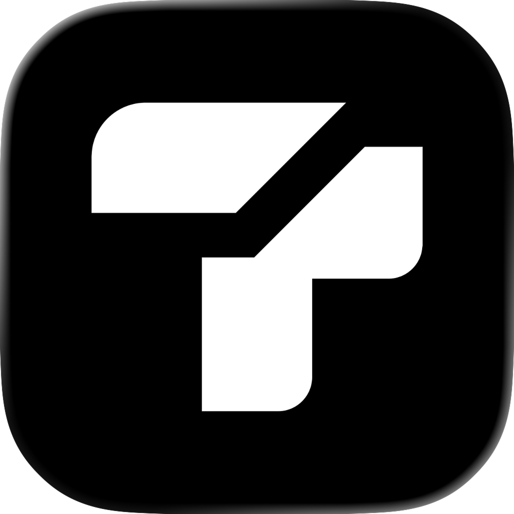
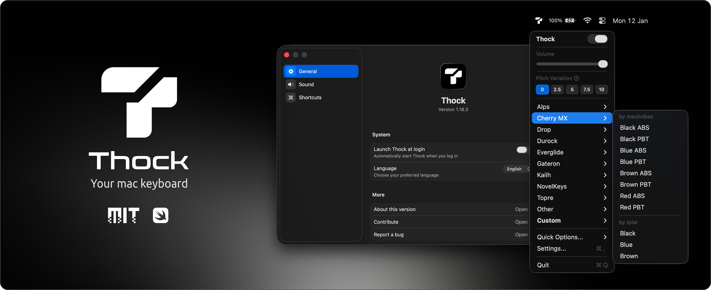
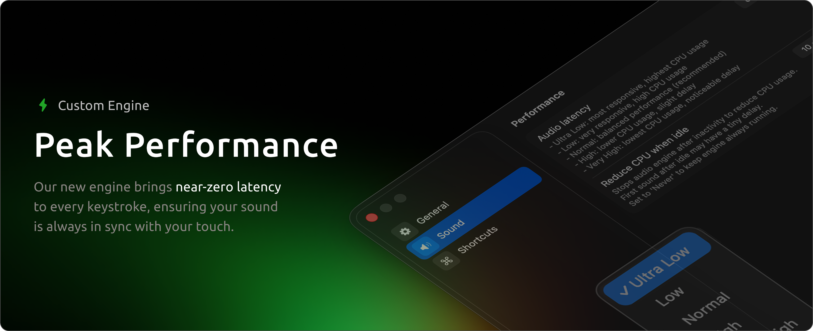
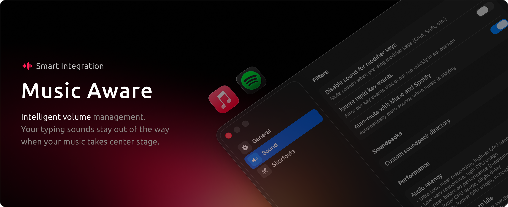

<a name="readme-top"></a>


<!-- PROJECT LOGO -->
<br />
<div align="center">
  
  <h3 align="center">Thock</h3>
  <p align="center">
    A native macOS utility that adds sound effects to your keyboard.
    <br />Blazing fast, lightweight and runs in the menu bar.
    <br /><br />
    <a href="https://github.com/kamillobinski/thock/releases/latest" target="_blank" rel="noopener noreferrer">
      
    </a>
    <a href="#" target="_blank" rel="noopener noreferrer">
      
    </a>
    <a href="https://deepwiki.com/kamillobinski/thock" target="_blank" rel="noopener noreferrer">
      
    </a>
  </p>
</div>


<!-- TABLE OF CONTENTS -->
<details>
  <summary>Table of Contents</summary>
  <ol>
    <li><a href="#about-the-project">About The Project</a></li>
    <li>
      <a href="#features">Features</a>
      <ul>
        <li><a href="#translation">Translation</a></li>
        <li><a href="#custom-engine">Custom Engine</a></li>
        <li><a href="#smart-integration">Smart Integration</a></li>
      </ul>
    </li>
    <li><a href="#getting-started">Getting Started</a></li>
    <li><a href="#license">License</a></li>
    <li><a href="#contributing">Contributing</a></li>
    <li><a href="#acknowledgments">Acknowledgments</a></li>
  </ol>
</details>


<!-- ABOUT THE PROJECT -->
## About The Project



Thock is a high-performance utility designed to bring the tactile satisfaction of mechanical switches to you macOS workspace. Built natively in Swift, it bridges the gap between hardware feel and software execution with zero compromises on speed or privacy.

Started this project to challege the status quo. While paid alternatives exist, Thock is built on the belief that the best tools should be open-source and community-driven. By focusing on a custom low-latency engine and deep system integration, Thock offers a professional-grade typing experience that stays out of your way and keeps your flow state intact.

<p align="right">(<a href="#readme-top">back to top</a>)</p>


<!-- FATURES -->
## Features


### Translation

With localization, Thock bridges the gap between powerful functionality and efortless usability. The interface is fully translated into English, 日本語 (Japanese) and 中文 (Chinese), allowing users to navigate the ecosystem without language barriers.

Select your preferred language in the general settings to enjoy a workspace tailored to your needs.

<p align="right">(<a href="#readme-top">back to top</a>)</p>




### Custom Engine

Features a custom audio engine built on native macOS AudioQueue APIs, achieving ultra-low latency that feels instantaneous. By bypassing standard high-level processing layers, we have eliminated perceptual lag to provide perfectly synced auditory feedback.

Whether you are a high-speed programmer or a creative writer, Thock ensures every keystroke is met with organic, realtime sound that keeps pace with your fastest workflow.

<p align="right">(<a href="#readme-top">back to top</a>)</p>




### Smart Integration

With music awareness, Thock intelligently manages your soundscape so you never have to manually toggle settings. By detecting active playback from apps like Spotify or Apple Music, it automatically mutes or ducks its typing sounds to let your music take priority.

As soon as the music stops, the app instantly resumes your mechanical feedback. It's a seamless, 'set-and-forget' feature designed for deep work sessions where your focus shifts between rhythm of your keys and the rhythm of your playlist.

<p align="right">(<a href="#readme-top">back to top</a>)</p>


### Custom Soundpacks

TODO

<p align="right">(<a href="#readme-top">back to top</a>)</p>


### Raycast Extension

TODO

<p align="right">(<a href="#readme-top">back to top</a>)</p>


<!-- GETTING STARTED -->
## Getting Started

It's quick and easy. You can either download a prebuilt release or build it yourself if you prefer.

> [!WARNING]  
> Thock requires macOS 13.5 Ventura or later.

### `A` Hombrew Cask Installation (recommended)

```sh
brew tap kamillobinski/thock
brew install --cask thock
```

or one command:
```sh
brew install --cask kamillobinski/thock/thock
```

<details>
<summary><b>B</b>: Release Download</summary>

1. Go to the [latest release](https://github.com/kamillobinski/thock/releases/latest)
2. Download `Thock-x.y.z.zip`
3. Unpack the ZIP file
4. Move the app to your Applications folder for easy access
5. Open Thock

</details>

<details>
<summary><b>C</b>: Build From Source</summary>

1. Clone the repository
   ```sh
   git clone https://github.com/kamillobinski/thock.git
   cd thock
   ```

2. Open in Xcode
   ```sh
   open Thock.xcodeproj
   ```

3. Build and run the application

</details>
   
<p align="right">(<a href="#readme-top">back to top</a>)</p>


<!-- LICENSE -->
## License

Distributed under the MIT License. See `LICENSE` for more information.

<p align="right">(<a href="#readme-top">back to top</a>)</p>


<!-- CONTRIBUTING -->
## Contributing

Got an idea or want to improve something? Awesome!

Check out the [contributing guide](./docs/CONTRIBUTING.md) for everything you need to know.

<p align="right">(<a href="#readme-top">back to top</a>)</p>


<!-- ACKNOWLEDGMENTS -->
## Acknowledgments

Thanks to the folks that helped make this project a reality!

**Community Contribution**

- [@distantorigin](https://github.com/distantorigin) - Fixed menu bar accessibility to ensure the app is fully responsive when using VoiceOver.
- [@SouhailBlmn](https://github.com/SouhailBlmn) - Volume persistence across output devices, global shortcut to toggle the app
- [@shailantani](https://github.com/shailantani) - Raycast extension ([source code](https://github.com/raycast/extensions/tree/main/extensions/thock))
- [@qalonbudker](https://github.com/qalonbudker) - Pitch variation for key sounds
- [@zenangst](https://github.com/zenangst) - Event handling, mode saving, perf improvements
- [@iamsoum](https://github.com/iamsoum) - Updated the sound pack conversion instructions for improved clarity and step-by-step guidance

<p align="right">(<a href="#readme-top">back to top</a>)</p>


<!-- MARKDOWN LINKS & IMAGES -->
[Swift-url]: https://img.shields.io/badge/swift-%23FA7343.svg?style=for-the-badge&logo=swift&logoColor=white
