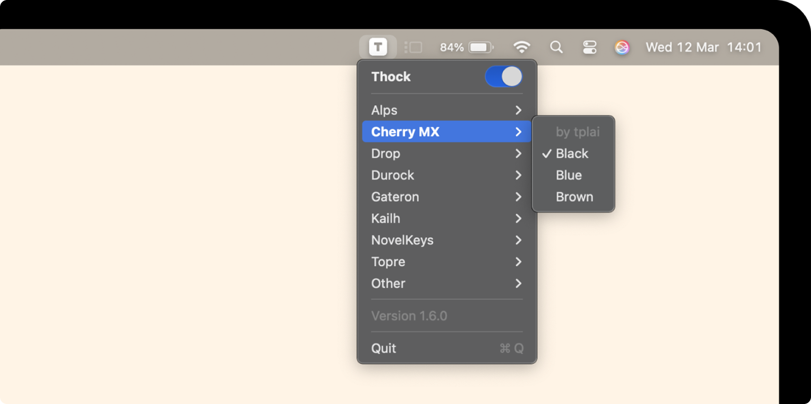

<a name="readme-top"></a>


<!-- PROJECT LOGO -->
<br />
<div align="center">
  
  <h3 align="center">Tapp</h3>
  <p align="center">
    A macOS utility that adds sound effects to your keyboard.
    <br />Lightweight, native and runs in the menu bar.
    <br /><br />
  </p>
</div>


<!-- TABLE OF CONTENTS -->
<details>
  <summary>Table of Contents</summary>
  <ol>
    <li>
      <a href="#about-the-project">About The Project</a>
      <ul>
        <li><a href="#built-with">Built With</a></li>
      </ul>
    </li>
    <li>
      <a href="#getting-started">Getting Started</a>
      <ul>
        <li><a href="#prerequisites">Prerequisites</a></li>
        <li><a href="#installation">Installation</a></li>
      </ul>
    </li>
    <li><a href="#usage">Usage</a></li>
    <li><a href="#contributing">Contributing</a></li>
    <li><a href="#license">License</a></li>
    <li><a href="#acknowledgments">Acknowledgments</a></li>
  </ol>
</details>


<!-- ABOUT THE PROJECT -->
## About The Project

Tapp is a native macOS utility that adds sound effects to your keyboard.

Built this project purely for fun and to explore Swift since I had never used it before.
The idea was simple - add some satisfying sound feedback to typing, kind of like a mechanical keyboard but purely in software.

Key features:
* ⚡ Minimal CPU & memory usage
* 🎛️ Menu bar integration
* 🎧 Modes switch

<p align="right">(<a href="#readme-top">back to top</a>)</p>


<!-- BUILT WITH -->
### Built With

![Swift][Swift-url]

<p align="right">(<a href="#readme-top">back to top</a>)</p>


<!-- GETTING STARTED -->
## Getting Started

To get a local copy up and running follow these simple steps.

### Prerequisites

Tapp requires macOS 15.2 Sequoia or later.

### Installation

1. Clone the repository
   ```sh
   git clone https://github.com/kamillobinski/tapp.git
   cd tapp
   ```
   
2. Open in Xcode
   ```sh
   open Tapp.xcodeproj
   ```
   
4. Build & Run<br/>
   <kbd>Command</kbd> + <kbd>B</kbd><br/>
   <kbd>Command</kbd> + <kbd>R</kbd>
   
<p align="right">(<a href="#readme-top">back to top</a>)</p>


<!-- USAGE EXAMPLES -->
## Usage



<p align="right">(<a href="#readme-top">back to top</a>)</p>


<!-- LICENSE -->
## License

Distributed under the MIT License. See `LICENSE` for more information.

<p align="right">(<a href="#readme-top">back to top</a>)</p>


<!-- CONTRIBUTING -->
## Contributing

Tapp is open-source and contributions are always welcome! 
If you want to improve the code, fix bugs or add new sound modes, open a pull request or an issue.

<p align="right">(<a href="#readme-top">back to top</a>)</p>


<!-- ACKNOWLEDGMENTS -->
## Acknowledgments

Thanks to the tools and resources that helped make this project a reality!

* [webdevcody/type-joy](https://github.com/webdevcody/type-joy) - keyboard sound recordings

<p align="right">(<a href="#readme-top">back to top</a>)</p>


<!-- MARKDOWN LINKS & IMAGES -->
[Swift-url]: https://img.shields.io/badge/swift-%23FA7343.svg?style=for-the-badge&logo=swift&logoColor=white
