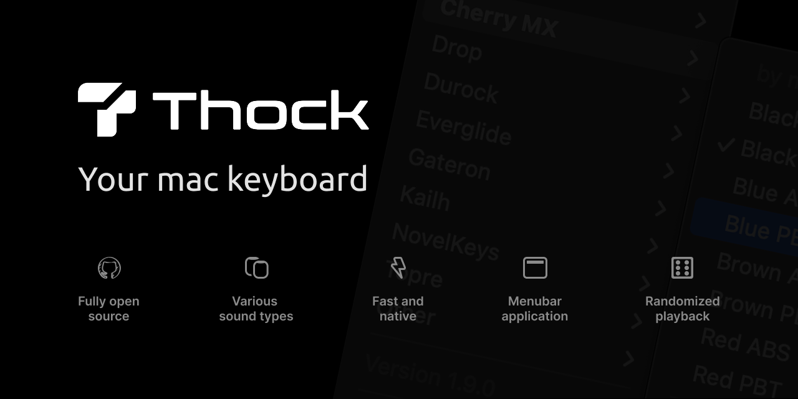
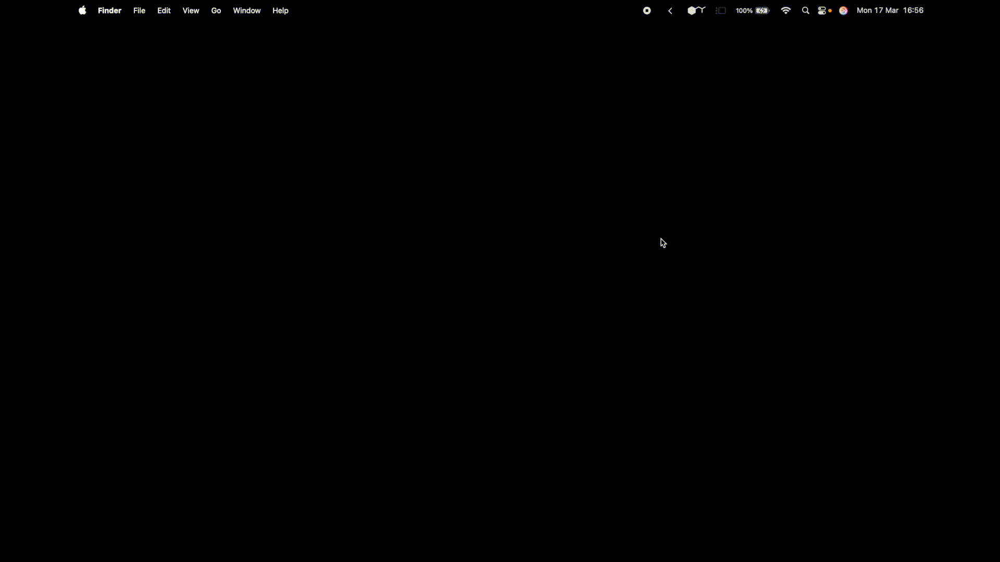

<a name="readme-top"></a>


<!-- PROJECT LOGO -->
<br />
<div align="center">
  
  <h3 align="center">Thock</h3>
  <p align="center">
    A macOS utility that adds sound effects to your keyboard.
    <br />Lightweight, native and runs in the menu bar.
    <br /><br />
    <a href="https://github.com/kamillobinski/thock/releases/latest" target="_blank" rel="noopener noreferrer">
      
    </a>
    <a href="https://deepwiki.com/kamillobinski/thock" target="_blank" rel="noopener noreferrer">
      
    </a>
  </p>
</div>


<!-- TABLE OF CONTENTS -->
<details>
  <summary>Table of Contents</summary>
  <ol>
    <li>
      <a href="#about-the-project">About The Project</a>
      <ul>
        <li><a href="#built-with">Built With</a></li>
      </ul>
    </li>
    <li>
      <a href="#getting-started">Getting Started</a>
    </li>
    <li><a href="#usage">Usage</a></li>
    <li><a href="#license">License</a></li>
    <li><a href="#contributing">Contributing</a></li>
    <li><a href="#acknowledgments">Acknowledgments</a></li>
  </ol>
</details>


<!-- ABOUT THE PROJECT -->
## About The Project



Thock is a native macOS utility that adds sound effects to your keyboard.

I built this project for fun, aiming to create a satisfying typing experience - like a mechanical keyboard, but entirely in software. Similar apps exist, but those written in other languages often lack proper macOS support or fall short in quality and functionality. There’s also Klack, a $5 paid alternative on the App Store, but I believe an open source community can do better lol.

Key features:
* &nbsp; Native macOS application
* ⚡ Minimal CPU & memory usage
* 📎 Menu bar utility
* 🔊 Over 25 unique sound modes
* 🕹️ Adjustable volume slider
* 🪄 [Raycast extension](#acknowledgments)

<p align="right">(<a href="#readme-top">back to top</a>)</p>


<!-- BUILT WITH -->
### Built With

![Swift][Swift-url]

<p align="right">(<a href="#readme-top">back to top</a>)</p>


<!-- GETTING STARTED -->
## Getting Started

It's quick and easy. You can either download a prebuilt release or build it yourself if you prefer.

> [!IMPORTANT]  
> Thock requires macOS 13.5 Ventura or later.

### → Option 1. Hombrew Installation (recommended)

1. Tap the repository
   ```sh
   brew tap kamillobinski/thock
   ```

2. Install Thock
   ```sh
   brew install thock
   ```

3. (Optional) Move it to your Applications folder
   ```sh
   thock --install
   ```

### Option 2. Release Download

1. Go to the [latest release](https://github.com/kamillobinski/thock/releases/latest)
2. Download `Thock-x.y.z.zip`
3. Unpack the ZIP file
4. Move the app to your Applications folder for easy access
5. Open Thock

### Option 3. Build From Source

1. Clone the repository
   ```sh
   git clone https://github.com/kamillobinski/thock.git
   cd thock
   ```
   
2. Open in Xcode
   ```sh
   open Thock.xcodeproj
   ```

3. Build and run the application
   
<p align="right">(<a href="#readme-top">back to top</a>)</p>


<!-- USAGE EXAMPLES -->
## Usage



<p align="right">(<a href="#readme-top">back to top</a>)</p>


<!-- LICENSE -->
## License

Distributed under the MIT License. See `LICENSE` for more information.

<p align="right">(<a href="#readme-top">back to top</a>)</p>


<!-- CONTRIBUTING -->
## Contributing

Got an idea or want to improve something? Awesome!

Check out the [contributing guide](./docs/CONTRIBUTING.md) for everything you need to know.

<p align="right">(<a href="#readme-top">back to top</a>)</p>


<!-- ACKNOWLEDGMENTS -->
## Acknowledgments

Thanks to the tools and folks that helped make this project a reality!

**Community Contribution**
- [@shailantani](https://github.com/shailantani) - Raycast extension<br/>
  <sub><sup>[[Raycast Store](https://www.raycast.com/shail_antani/thock) • [Source](https://github.com/raycast/extensions/tree/main/extensions/thock)]</sup></sub>
- [@qalonbudker](https://github.com/qalonbudker) - Pitch variation for key sounds
- [@zenangst](https://github.com/zenangst) - Event handling, mode saving, perf improvements

**Keyboard Sound Recordings**
- [hainguyents13/mechvibes](https://github.com/hainguyents13/mechvibes/)
- [tplai/kbsim](https://github.com/tplai/kbsim)
- [webdevcody/type-joy](https://github.com/webdevcody/type-joy)

<p align="right">(<a href="#readme-top">back to top</a>)</p>


<!-- MARKDOWN LINKS & IMAGES -->
[Swift-url]: https://img.shields.io/badge/swift-%23FA7343.svg?style=for-the-badge&logo=swift&logoColor=white
